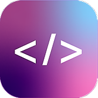

# Codability
Final Year Project

An app to help encourage more women to learn code in a personalised and interactive way. This is a Cordova Application built with HTML, CSS, PHP, JavaScript (Jquery&AJAX). 

The app is built for both IOS and Android Platforms. 

Link: https://court191.github.io/Codability/

